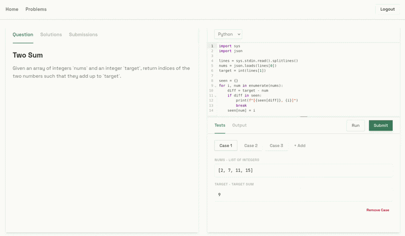
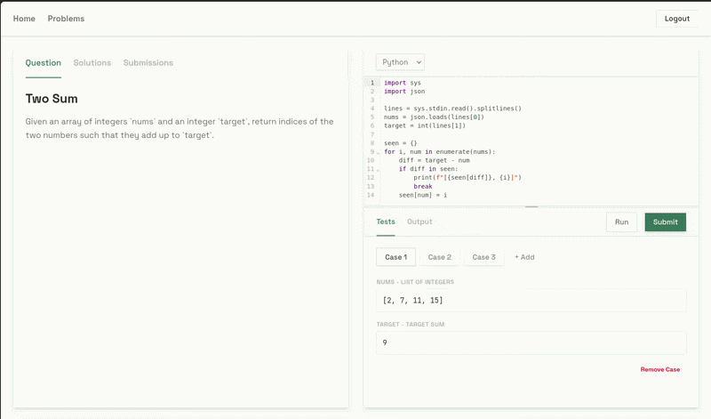

<a id="readme-top"></a>

<!-- PROJECT LOGO -->
<br />
<div align="center">
  <h3 align="center">AlgoBio Backend (Public demo)</h3>

  <p align="center">
    The backend of a leetcode clone for learning bioinformatics and Machine Learning.
    <br />
    <br />
  </p>
</div>

<!-- ABOUT THE PROJECT -->
## About The Project


**NOTE** :

As it will be commercialized. ***This repo will always be a public demo lacking domain specific modifications.***

Updated on a best-effort basis.


## AI Usage
Used [Antigravity CLI](https://antigravity.google/docs) (Gemini 4.5 Pro extended) paired with [Openspec SDD](https://openspec.dev) skill for:
1. Writing down acceptance criteria for features in markdown.
2. Discussing edge cases and trade-offs.
3. Writing tests.
4. Writing the first draft of this readme.

*So I had the pleasure of writing the code myself.*

## Features

* Code execution via Judge0
  
  
* Automated code evaluation against predefined test cases
  
  
* OAuth2 authentication
* REST API built with FastAPI
* Database managed with PostgreSQL, SQLAlchemy, and Alembic

### Built With

 [![FastAPI][FastAPI.com]][FastAPI-url]
 [![PostgreSQL][PostgreSQL.com]][PostgreSQL-url]
 [![SQLAlchemy][SQLAlchemy.com]][SQLAlchemy-url]
 [![Judge0][Judge0.com]][Judge0-url]
 [![Python][Python.org]][Python-url]

## Getting Started

To get a local copy up and running, follow these simple example steps.

### Prerequisites

You will need the following tools installed on your local machine:
* Python 3.14 or newer
* [uv](https://docs.astral.sh/uv/) (Python package manager)
* Docker and Docker Compose (for the PostgreSQL database)

### Installation

1. **Clone the repo**
   ```sh
   git clone https://github.com/Mxkyp/Algobio-demo.git && cd Algobio-demo
   ```

2. **Install dependencies using `uv`**
   ```sh
   uv sync
   ```

3. **Set up Environment Variables**
   Create a `.env` file in the root directory. 
   
   For code execution, this project is configured to use Judge0. To get started quickly without hosting your own runner, you can point to the free public instance.
   
   At a minimum, you'll need the following in your `.env`:
   ```env
   # Database Configuration
    API_BASE_URL=http://localhost:2358
    X_AUTH_TOKEN=abc123
    X_AUTH_USER=mySecretToken
    DB_USERNAME=postgres
    DB_PASS=example
    DB_HOST=localhost
    DB_PORT=5432
    DB_NAME=postgres

    # Google OAuth2 Authentication
    google_client_id=ADD_YOURS_HERE
    google_client_secret=ADD_YOURS_HERE
    google_redirect_uri=http://localhost:8000/auth/callback/google
    jwt_secret_key=abc
    
    # Judge0 Code Execution
    JUDGE0_HOST=https://ce.judge0.com
   ```

4. **Start the Database**
   ```sh
   docker-compose up -d
   ```

5. **Run Database Migrations**
   ```sh
   uv run alembic upgrade head
   ```

6. **Start the Development Server**
   ```sh
   uv run fastapi dev main.py
   ```

## Usage

The API is fully documented using OpenAPI. Once the development server is running, you can interact with the endpoints and view the documentation at:
* **Swagger UI**: `http://localhost:8000/docs`
* **ReDoc**: `http://localhost:8000/redoc`

### Key Endpoints:
* `POST /submit` - Submit bioinformatics code for evaluation via Judge0
* `POST /run` - Run code snippets instantly
* `GET /submit/{problem_id}/me` - Get a user's submission history
* `GET /users/me` - Fetch the authenticated Google OAuth user profile

## Roadmap
* [ ] Refactor API routes and database operations to be mostly asynchronous
* [ ] Add additional OAuth2 providers (e.g., GitHub, ORCID)
* [ ] Add streak mechanism for motivating users
* [ ] Add admin dashboard endpoints
* [ ] Add user  dashboard endpoints
* [ ] Add problem view endpoints
* [ ] Add unsecured profile so others can self-host this without creating OAuth2 credentials


<!-- CONTACT -->
## Contact

**Mikołaj Pawłoś**

[mpawlos.com](https://mpawlos.com/) | [mikolaj.pawlos@poczta.fm](mailto:mikolaj.pawlos@poczta.fm) | [LinkedIn](https://www.linkedin.com/in/mikołaj-pawłoś/)

<!-- MARKDOWN LINKS & IMAGES -->
[FastAPI.com]: https://img.shields.io/badge/FastAPI-005571?style=for-the-badge&logo=fastapi
[FastAPI-url]: https://fastapi.tiangolo.com/
[PostgreSQL.com]: https://img.shields.io/badge/PostgreSQL-316192?style=for-the-badge&logo=postgresql&logoColor=white
[PostgreSQL-url]: https://www.postgresql.org/
[SQLAlchemy.com]: https://img.shields.io/badge/SQLAlchemy-D71F00?style=for-the-badge&logo=sqlalchemy&logoColor=white
[SQLAlchemy-url]: https://www.sqlalchemy.org/
[Judge0.com]: https://img.shields.io/badge/Judge0-000000?style=for-the-badge&logo=codeforces&logoColor=white
[Judge0-url]: https://judge0.com/
[Python.org]: https://img.shields.io/badge/Python-3776AB?style=for-the-badge&logo=python&logoColor=white
[Python-url]: https://www.python.org/
